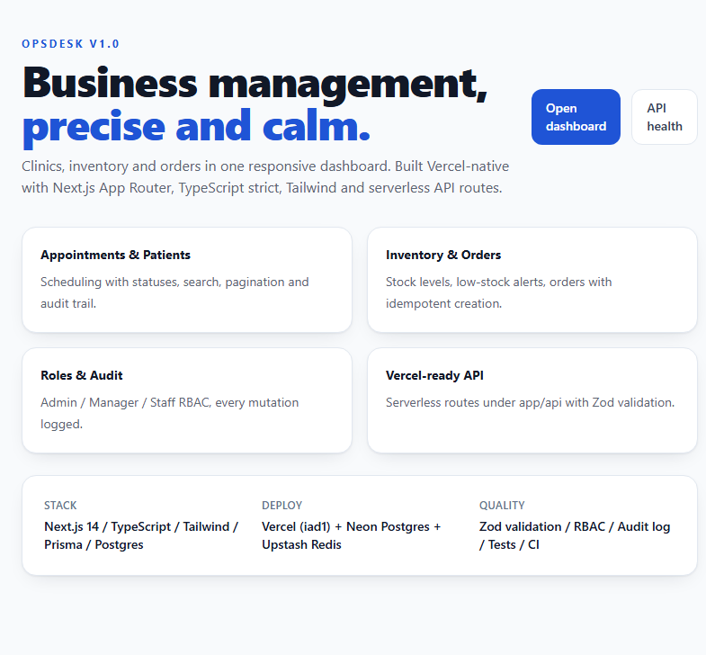
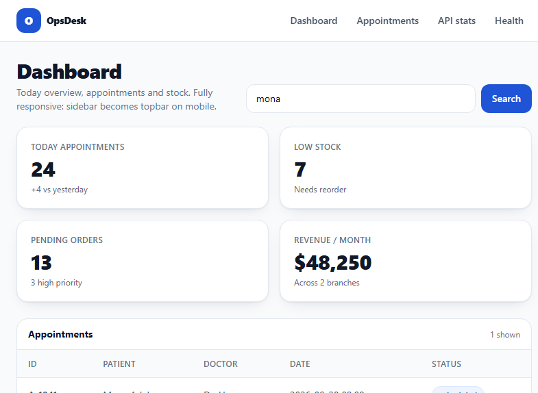
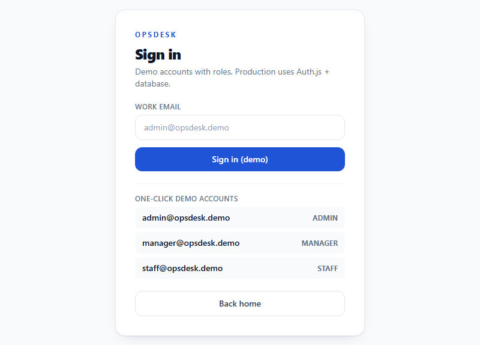
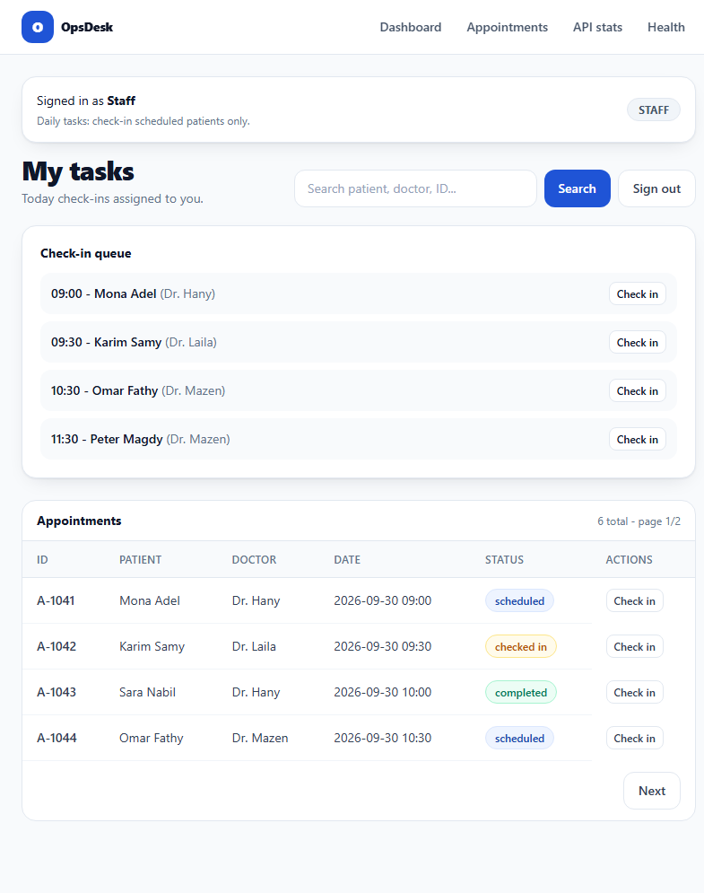
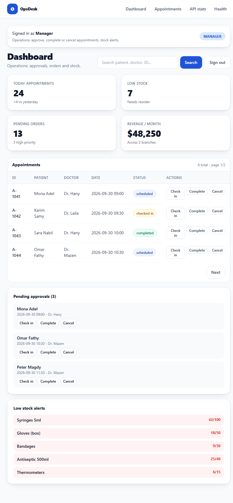
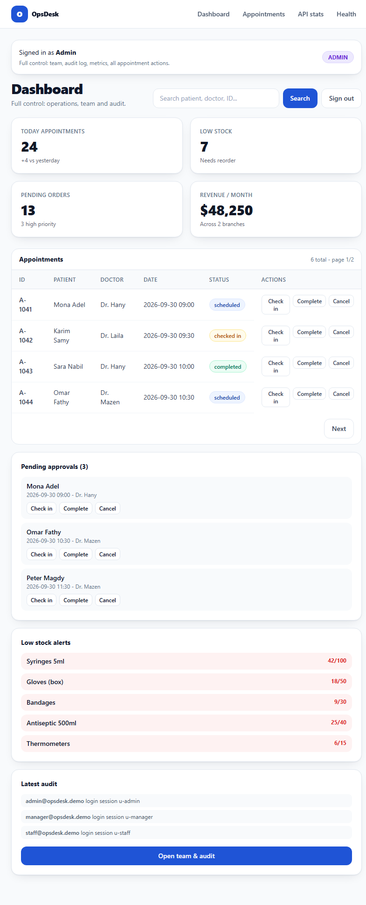
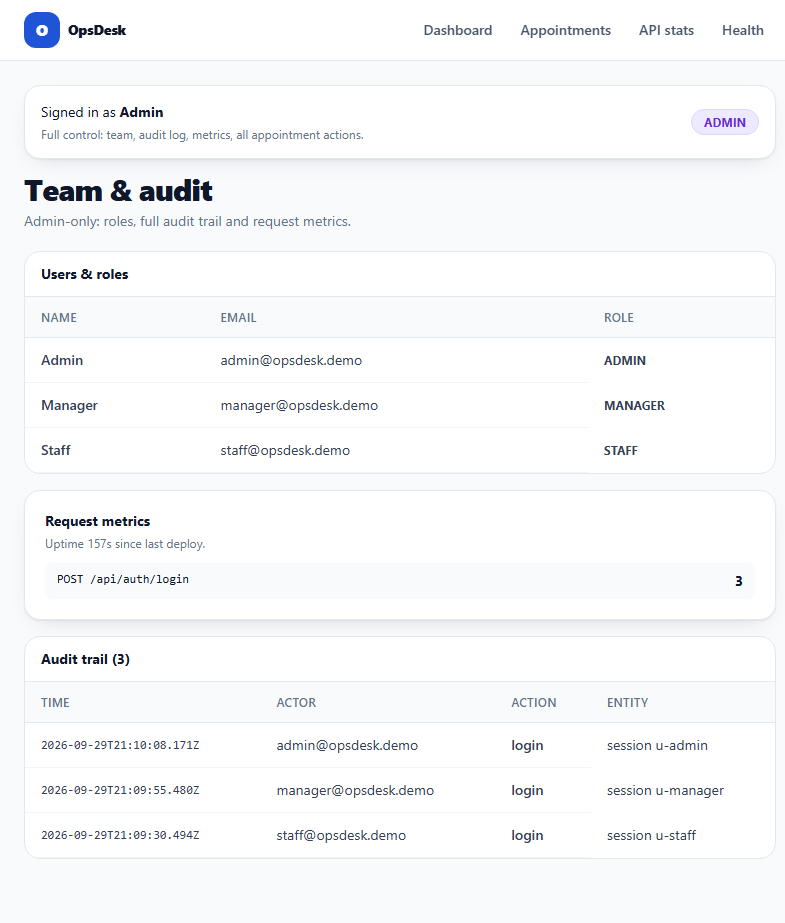
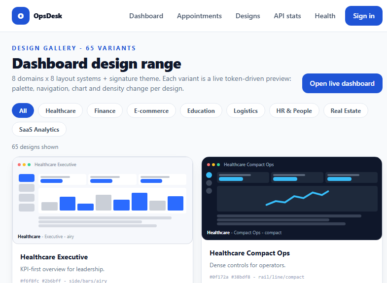
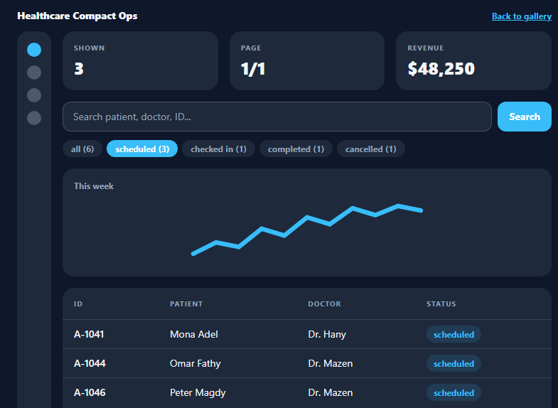

# OpsDesk - Business Management SaaS
opsdesk123
[](https://github.com/aslamalkarywk7/opsdesk/actions/workflows/ci.yml)

Vercel-native full-stack: Next.js 14 App Router + TypeScript strict + Tailwind + Auth.js v5 + Prisma + Zod + serverless API routes. Neon Postgres in production, demo memory store locally.

Live: https://opsdesk-vjez.vercel.app/ — import this repo in Vercel (Root Directory `./` empty, framework Next.js). No database required for demo; production Prisma schema in `prisma/schema.prisma` targets Neon Postgres. Full steps in [docs/DEPLOYMENT.md](docs/DEPLOYMENT.md) + [docs/DEPLOY-CHECKLIST.md](docs/DEPLOY-CHECKLIST.md).

## Installation

Prerequisites: Node.js >= 18.17 (CI uses 22), npm, Git. Optional: Neon Postgres account (production data), Vercel account (hosting).

```bash
git clone https://github.com/aslamalkarywk7/opsdesk.git
cd opsdesk
npm install
cp .env.example .env.local   # then set AUTH_SECRET (openssl rand -base64 32)
npm run dev     # http://localhost:3000
```

| Command | What it does | Needs |
|---|---|---|
| `npm run dev` | local dev server | `.env.local` with `AUTH_SECRET` |
| `npm test` | offline unit suite (7/7) | nothing |
| `npm run build` | `prisma generate && next build` (same as Vercel) | nothing (demo works without DB) |
| `npm run db:push` + `npm run db:seed` | create + seed Neon tables | `DATABASE_URL` in `.env.local` |
| `npm run smoke` | 25 live-server checks | built + started server, `AUTH_SECRET`, `DEMO_PASSWORD` |
| `npm run e2e` | 5 Chromium flows | running server + `npx playwright install` |

Key env vars (`AUTH_SECRET` preferred, `NEXTAUTH_SECRET` also read; demo password default `opsdesk123`): full table in [docs/DEPLOYMENT.md](docs/DEPLOYMENT.md), 15-minute go-live in [docs/DEPLOY-CHECKLIST.md](docs/DEPLOY-CHECKLIST.md).

## Routes

- `/` - landing + 65-design banner
- `/login` - Auth.js credential sign-in per role
- `/dashboard` - role-aware dashboard with search, pagination, actions
- `/team` - ADMIN users, audit trail, metrics
- `/showcase` - 65-variant gallery with domain filter
- `/showcase/[id]` - live themed workspace (search, status filter, sort, pagination)
- `/api/health` - liveness probe (+ `db` flag)
- `/api/stats` - Zod-validated KPIs
- `/api/appointments?q=&page=&limit=` - list + `POST` create with validation
- `/api/appointments/status` - transitions + RBAC
- `/api/audit` - ADMIN trail
- `/api/metrics` - counters
- `/api/errors` - client beacon

Auth API (`/api/auth/*`: session, CSRF, sign-out, credentials callback) is documented in [docs/API.md](docs/API.md).

## Professional docs

| Doc | Covers |
|---|---|
| [docs/ARCHITECTURE.md](docs/ARCHITECTURE.md) | system design, data flow, Vercel mapping |
| [docs/ROLES.md](docs/ROLES.md) | role dashboards, RBAC matrix, enforcement, screenshots |
| [docs/DESIGNS.md](docs/DESIGNS.md) | 65-variant gallery, what it proves, CV bullet |
| [docs/DESIGN-SKILLS.md](docs/DESIGN-SKILLS.md) | design & layout skills, Q&A on dashboard diversity |
| [docs/API.md](docs/API.md) | endpoints, validation, errors |
| [docs/DATABASE.md](docs/DATABASE.md) | ERD + indexes + Prisma rollout |
| [docs/SECURITY.md](docs/SECURITY.md) | headers, RBAC plan, OWASP notes |
| [docs/CODE-STYLE.md](docs/CODE-STYLE.md) | senior conventions used here |
| [docs/DEPLOYMENT.md](docs/DEPLOYMENT.md) | Vercel deploy steps + env vars |
| [docs/DEPLOY-CHECKLIST.md](docs/DEPLOY-CHECKLIST.md) | 15-minute go-live checklist |
| [docs/FILES.md](docs/FILES.md) | one doc per code file (47) - what each file does |
| `public/screenshots/` | 10 UI captures + `designs/` (all 65 variants across 9 pages) for CV |

## Screenshots (in `public/screenshots/`)

Landing:



Dashboard (role-aware table + actions):


Live search (`?q=mona` -> 1 shown):



Sign-in with demo accounts per role:



STAFF check-in queue (Check in only):



MANAGER stats, approvals, stock alerts:



ADMIN full control + latest audit:



ADMIN users, metrics, audit trail:



65-variant design gallery:



Live themed workspace (/showcase/d-2):



All 65 variants + one page per domain (8 files) in `designs/`:


## Verified quality gates

- `npm test` - 7/7 passing (money format, appointment filter, pagination, 65-gallery count, module sync, ranks, transitions)
- `npm run smoke` - 25 live-server checks: Auth.js login, RBAC matrix, pagination, validation contracts, gallery + live-design interactivity, metrics
- `npm run e2e` - 5/5 real Chromium flows: guards, per-role dashboards, search, team RBAC (transitions covered by unit + smoke)
- `npm run build` - Next.js 14.2.35 production build, 80 static pages incl. 65 live designs + Auth.js middleware, First Load ~96 kB
- API: `GET /api/stats` 200 with Zod contract, `POST /api/appointments` 400 on unparsable body / 422 on Zod failure, `POST /api/appointments/status` enforces transitions + roles
- Auth: HMAC-signed cookie sessions, `/dashboard` guarded, `/team` + `/api/audit` ADMIN-only
- Lighthouse (landing, desktop, measured Oct 2026): Accessibility 98, Best Practices 100, SEO 100. Performance varies per deploy - re-run with `npx lighthouse https://opsdesk-vjez.vercel.app/ --view`.

## Roles (demo accounts, password `opsdesk123`)

- `staff@opsdesk.demo` / STAFF - check-in queue + check-in only
- `manager@opsdesk.demo` / MANAGER - approvals, stock alerts, complete/cancel
- `admin@opsdesk.demo` / ADMIN - everything + `/team` users, audit trail, metrics

Details + enforcement in [docs/ROLES.md](docs/ROLES.md).

## CV bullets (English)

- Built responsive SaaS dashboard (Next.js, TypeScript, Tailwind) with serverless APIs, Zod validation, search and paginated tables.
- Designed production Prisma/Postgres schema with RBAC, audit log and indexes; documented rollout to Neon.
- Hardened for Vercel: security headers, no-store APIs, validated inputs, clean error contracts.

## License

MIT - see [LICENSE](LICENSE). Copyright 2026 Islam El-Nashar.
