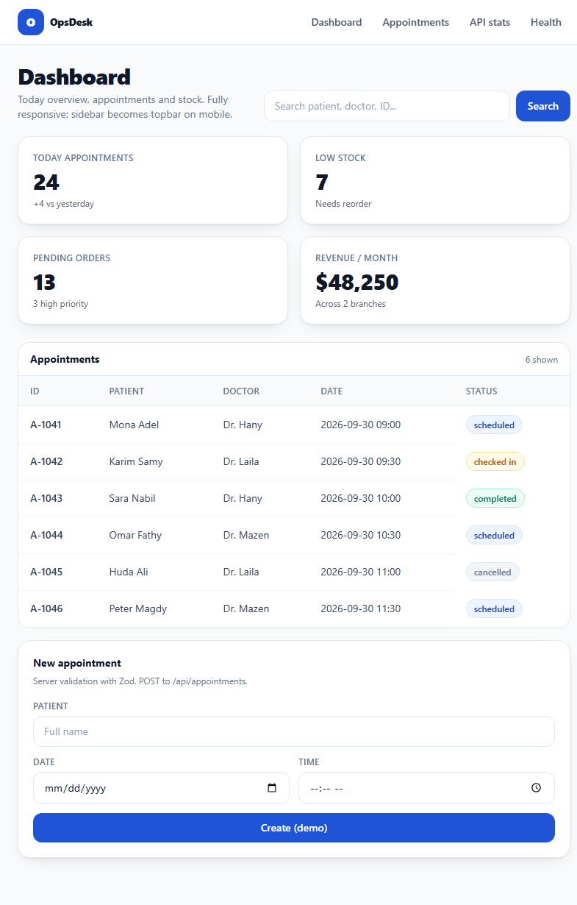

# `app/dashboard/page.tsx`

> Role-aware dashboard (SSR): queue for STAFF, full ops for MANAGER/ADMIN.

## What it does

- Requires login (redirects to `/login?next=/dashboard`).
- STAFF: "My tasks" check-in queue. Others: KPI cards, approvals, stock alerts.
- Table with search (`q`) + pagination (4/page); actions POST to `/api/appointments/status`.
- ADMIN panel: latest audit + link to `/team`.

## Key behavior

- Rows from `listAppointments()` (Postgres or demo) with a Live database / Demo data badge; KPIs + inventory stay demo constants.

## Screenshot

Role variants: `dashboard-staff.png`, `dashboard-manager.png`, `dashboard-admin.png` in `public/screenshots/`.

## Links

- Source: `../../app/dashboard/page.tsx`
- Actions: [app-api-appointments-status-route.md](app-api-appointments-status-route.md)
- Components: [components-stat-card.md](components-stat-card.md), [components-status-badge.md](components-status-badge.md), [components-role-banner.md](components-role-banner.md)
- Guide: [ROLES](../ROLES.md)
- Index: [FILES](../FILES.md)
